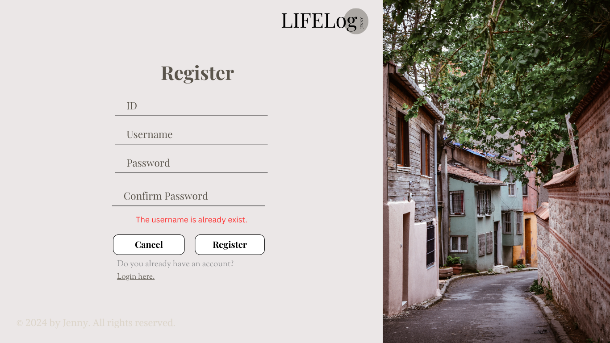
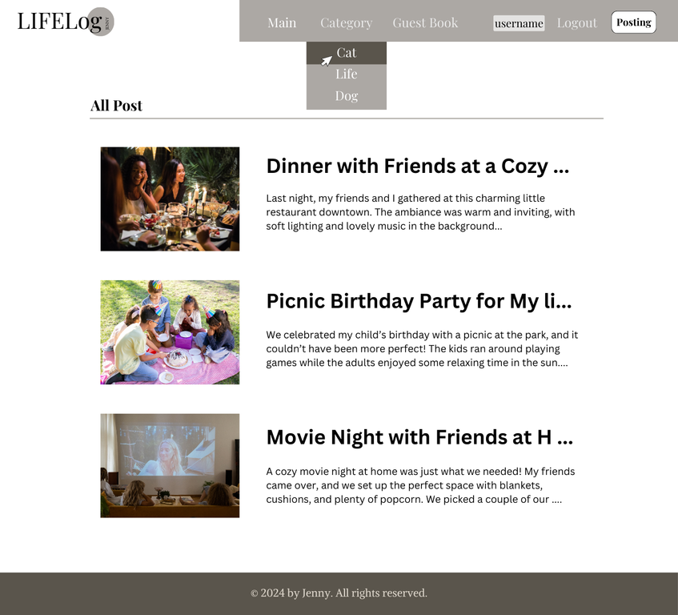
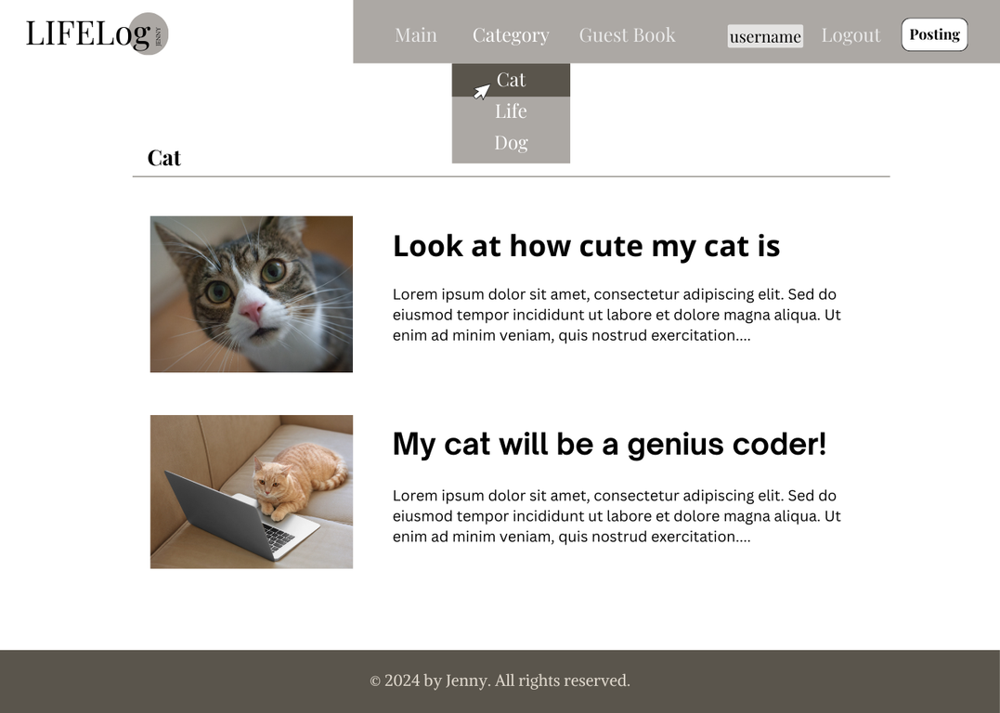
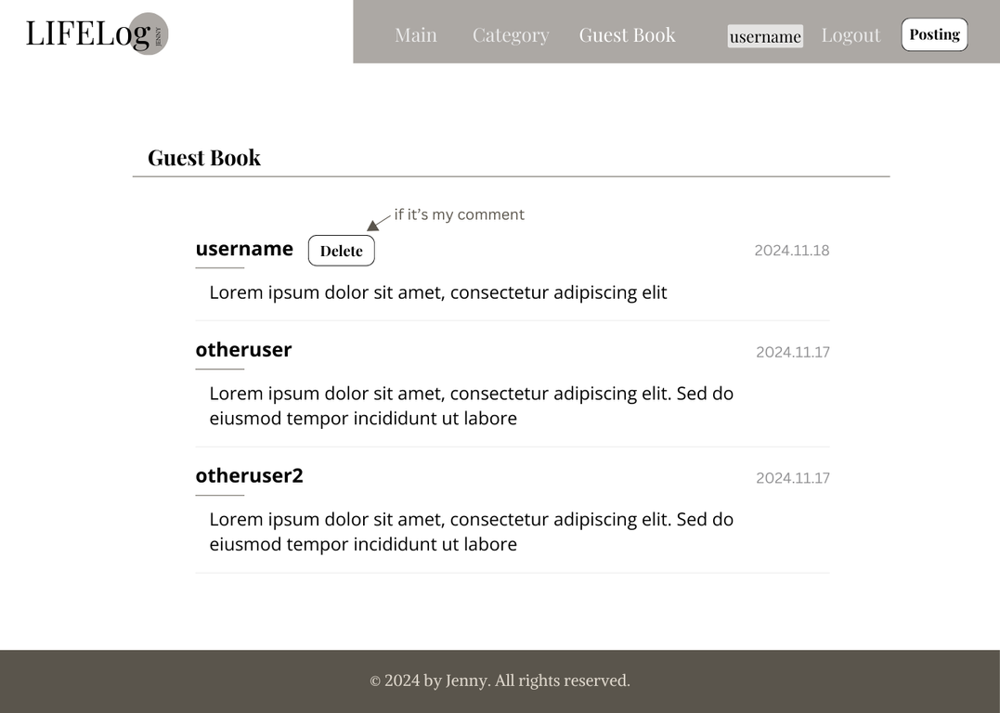
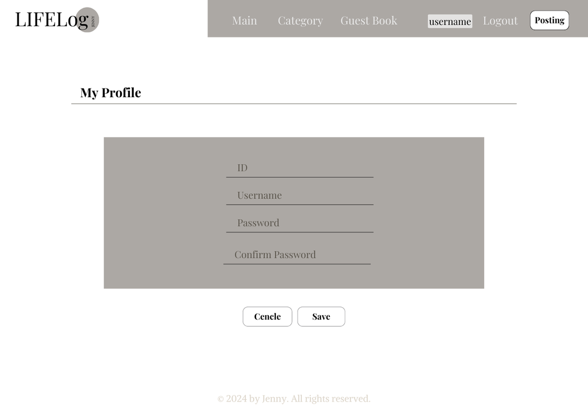
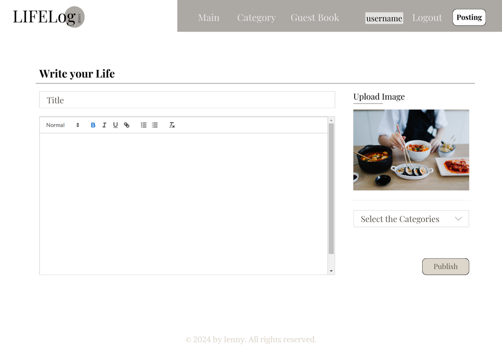
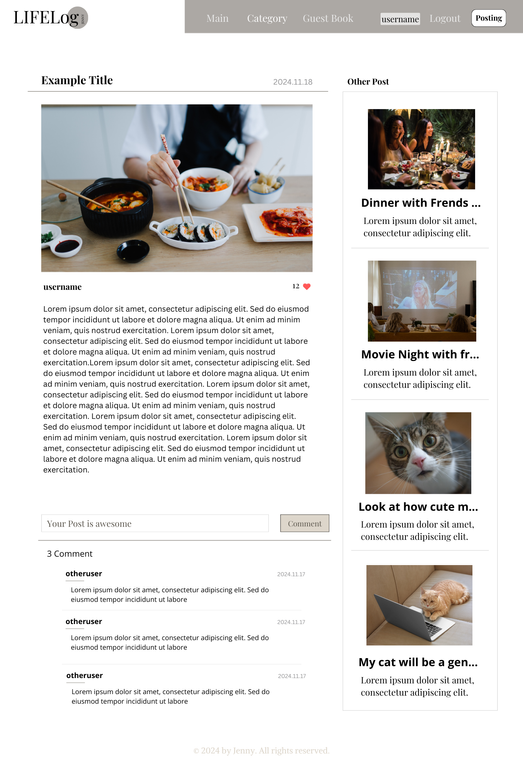
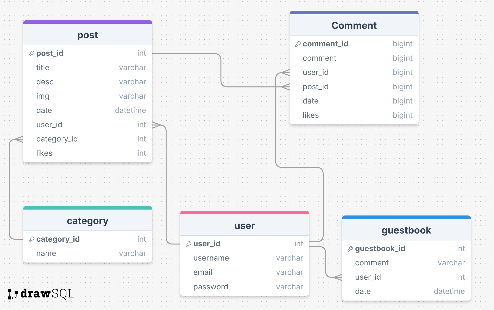

# Lifelog Project Proposal

## Overview

**Lifelog** is a platform where users can record and share their daily lives. Users can post photos, texts about their activities and interact with others.

### Problem Statement

- Lack of suitable platforms for recording daily life.
- Need a space to store and share personal memories.
- Users seek an alternative to complex, ad-filled social media platforms.

### User Profile

- Users who want to record or share their daily life.
- Users preferring a simple and intuitive interface.
- Users interested in interacting through likes, comments, and guestbook messages.

### Features

- User Registration and Login.
- Create, update, and delete personal posts.
- Add, edit, or remove comments on posts.
- Like posts and leave guestbook messages.
- **Extra Features**: Likes and a Guestbook section for visitor interactions.

---

## Implementation

### Tech Stack

- **Frontend**: React (TypeScript, Sass, React Router, Axios)
- **Backend**: Express, Node (Knex, bcrypt, JWT)
- **Database**: MySQL

### APIs

- **Authentication**: User registration, login, logout, and user profile management.
- **Posts**: CRUD operations for posts and categories.
- **Comments**: Manage comments per post.
- **Guestbook**: Add, update, and delete guestbook comments.
- **Likes**: Add or remove likes from posts.

### Sitemap

- Home (before login)
- Posts: All Posts, Category-wise Posts, Single Post
- User Features: Profile, Writing Page
- Authentication: Register, Login
- Extra: Guestbook

---

## Mockups

### Screenshots

- **Home Page (Before Login)**  
  
- **Register Page**  
  
- **Login Page**  
  
- **All Posts**  
  
- **Category-wise Posts**  
  
- **Guestbook**  
  
- **Profile Page**  
  
- **Writing Page**  
  
- **Single Post Page**  
  

---

## Data Structure

- **Database Schema**  
  

---

## API Endpoints

### Authentication and User Management

| Endpoint             | Method | Description                     |
| -------------------- | ------ | ------------------------------- |
| `/api/auth/register` | POST   | User registration               |
| `/api/auth/login`    | POST   | User login                      |
| `/api/auth/logout`   | POST   | User logout                     |
| `/api/users/:id`     | GET    | Get user profile information    |
| `/api/users/:id`     | PUT    | Update user profile information |

### Post Management

| Endpoint         | Method | Description                 |
| ---------------- | ------ | --------------------------- |
| `/api/posts`     | GET    | Get all posts               |
| `/api/posts/:id` | GET    | Get a specific post         |
| `/api/posts`     | POST   | Create a new post           |
| `/api/posts/:id` | PUT    | Update a post (author only) |
| `/api/posts/:id` | DELETE | Delete a post (author only) |

### Comment Management

| Endpoint                                 | Method | Description                    |
| ---------------------------------------- | ------ | ------------------------------ |
| `/api/posts/:postId/comments`            | GET    | Get comments for a post        |
| `/api/posts/:id/comments`                | POST   | Add a comment to a post        |
| `/api/posts/:postId/comments/:commentId` | PUT    | Update a comment (author only) |
| `/api/posts/:postId/comments/:commentId` | DELETE | Delete a comment (author only) |

### Guestbook

| Endpoint             | Method | Description                 |
| -------------------- | ------ | --------------------------- |
| `/api/guestbook`     | GET    | Get all guestbook messages  |
| `/api/guestbook`     | POST   | Add a new guestbook message |
| `/api/guestbook/:id` | PUT    | Update a guestbook message  |
| `/api/guestbook/:id` | DELETE | Delete a guestbook message  |

---

## Roadmap

### Frontend Development

1. Set up React project.
2. Implement authentication pages (Register, Login).
3. Create posts and categories pages.
4. Add a user profile page with editing capabilities.
5. Add extra features: Likes and Guestbook.

### Backend Development

1. Set up Express server and define routes.
2. Create database schema, migrations, and seed data.
3. Implement JWT authentication for secure login.
4. Implement CRUD for posts, comments, and guestbook.

### Integration

1. Ensure client-server communication via Axios.
2. Implement JWT handling for secure API access.

### Deployment

1. Deploy the backend (e.g., AWS, Render).
2. Deploy the frontend (e.g., Netlify).
3. Configure environment variables securely.

---

## Nice-to-Have Features

- Forgot Password functionality.
- Email confirmation during registration.
- User role management (e.g., admin vs user).

---

## Timeline

- Week 1: Set up the environment and create basic features.
- Week 2: Build core functionalities and test integration.
- Week 3: Implement extra features and perform debugging.
- Week 4: Final testing, deployment, and preparation for demo day.
